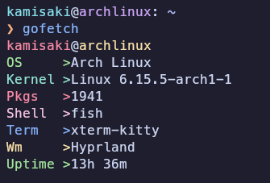

# gofetch

🫧 Minimal sysfetch tool written in **Go**

> I built this project to practice and improve my Go skills.

## Installation

```
git clone https://github.com/xeyossr/gofetch.git
cd gofetch
make install
```

## Screenshots


